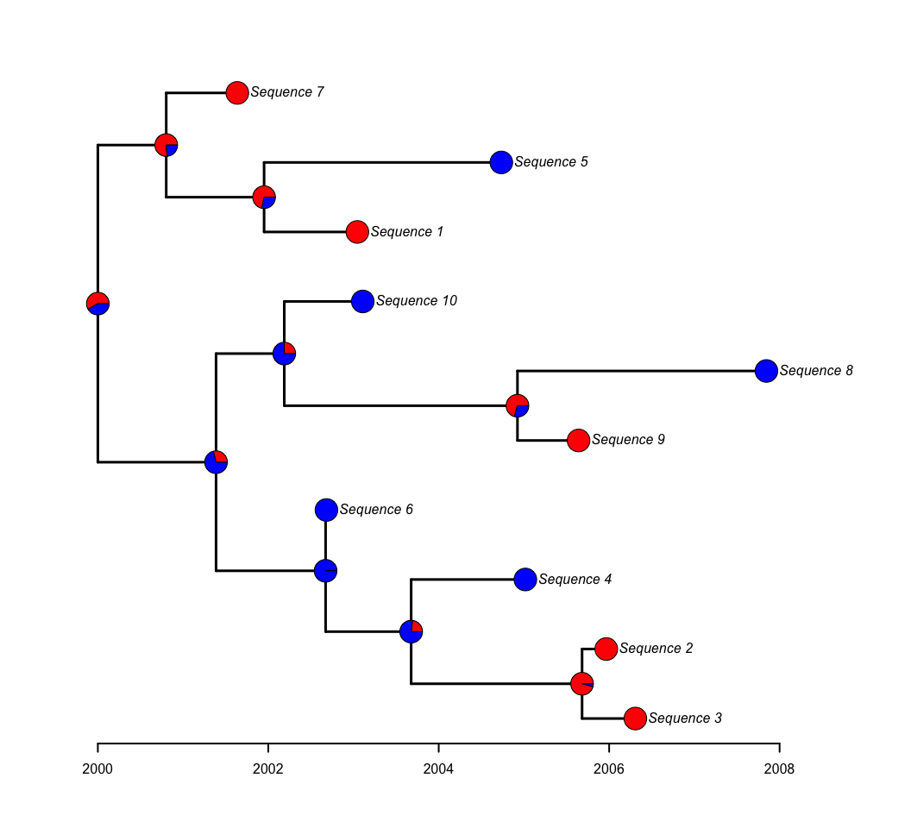
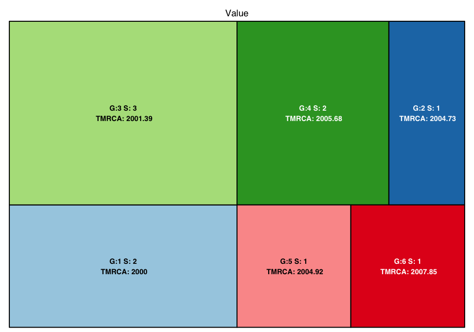

<!-- README.md is generated from README.Rmd. Please edit that file -->

# LineageHomology

-   [Installation](#installation)
-   [Introduction](#introduction)
-   [Tutorial and gallery of plotting methods](#tutorial)

<!-- badges: start -->
<!-- badges: end -->

LineageHomology provides a set of functions that analyses the outputs
from ancestral state reconstructions. LineageHomology takes the output
of an ancestral state reconstruction method with included state
probabilities at each node and defines transmission lineages (TLs) and
singletons based on this. A TL is defined as a connected group of tips
where state transitions between ancestral and descendant nodes have a
probability lower than 50 percent. Singletons are defined as tips that
are not connected to any other tips in this way. The method is analogous
to that introduced by du Plessis et al. (2021) (DOI:
10.1126/science.abf2946). LineageHomology also provides descriptions of
the sizes of TLs, the number of singletons, functions to derive
estimates of importation and local transmission based on this and other
useful summaries. The package also includes a variety of functions to
plot the results.

## Installation

You can install the latest version of LineageHomology from this
repository by using devtools:

``` r
library(devtools)
devtools::install_github("magnusnosnes/LineageHomology")
```

## Introduction

This introduction provides a simple example of applying ancestral state
reconstruction to simulated geographical data for two locations and
using LineageHomology to analyse the outputs. Here, LineageHomology
provides descriptions of transmission lineages other plots the sizes and
estimated time of the most recent common ancestor for each TL.

First, we simulate data and estimate the ancestral geographical states:

``` r
library(LineageHomology)
#Loading required packages.
library(ape)
#Loading other packages for simulating data. 
library(BactDating)

#Simulate data from Norway and rest of the world
set.seed(11,sample.kind = "Rounding") #11 is good
```

    ## Warning in set.seed(11, sample.kind = "Rounding"): non-uniform 'Rounding'
    ## sampler used

``` r
tree_test = simdatedtree(nsam=10, dateroot=2000)
tree_test = ladderize(tree_test)
load(file="/Users/magnusnygardosnes/Dropbox/Rfunctions/Rpackages/LineageHomology/Examples_and_plotting_methods/Tree.Rdata") #Overwrite tree because of an issue with the RNG in rmarkdown.
tiplabels=c("Sequence 7","Sequence 1","Sequence 5","Sequence 6","Sequence 4","Sequence 3","Sequence 2","Sequence 9","Sequence 8","Sequence 10")
tree_test$tip.label=tiplabels
loc = c("Norway", "Norway","RoW","RoW", "RoW", "Norway", "Norway", "Norway", "RoW", "RoW")
names(loc) = tree_test$tip.label

#Reconstruct ancestral states using ace. 
fit1 = ace(x=loc, phy= tree_test, type="discrete", mod="ARD")
plot.phylo(tree_test,edge.width = 3,label.offset = 0.15, mar=c(0.2,0.2,0.2,0.2))
axisPhylo(root.time=2000, backward=F,lwd=2)
nodelabels(pie=fit1$lik.anc,cex=0.7,piecol=c("Red","Blue"))
tips = to.matrix(loc,seq=c("Norway", "RoW"))
tiplabels(pie=tips, cex=0.7,piecol=c("Red","Blue"))
```

<!-- --> The tree
shows the reconstructed states using the ace function in the ape
package. Each node is coloured according to the probability of the
location. Here red represents Norway, and blue represents the rest of
the world (RoW).


This figure shows how LineageHomology estimates transmission lineages,
singletons, importation and local transmission events. A blue-shaded
background indicates transmission lineages and covers the tips that are
included in the group. The transmission lineages are defined based on a
50 percent probability of the same state on every node in the TL. The
red shaded background shows singletons, which are unconnected to any
other tips based on the rule that defines TLs. The areas that describe
TLs and singletons stretch back to the date that LineageHomology uses as
the importation date, which is on the midpoint of the edge ancestral to
the MRCA for the TLs, and on the midpoint on the ancestral edge leading
to the first geographical transitions for singletons. The importation
dates are also indicated by blue stippled lines, ending in blue dots on
the time axis. Branching events are used as estimates of local
transmission inside of transmission lineages. This is also indicated by
the red stippled lines ending in red dots on the time axis.

Next we run lineageHomology on the output from ace according to the
approach outlined above.

``` r
Return = LineageHomology(tree_test, ace_nodes=fit1$lik.anc,
                        ace_tips = to.matrix(loc, seq=c("Norway", "RoW")), start_time=2000)
Return
```

    ## $Import_LocalTrans
    ## [1] 6 4
    ## 
    ## $Lineage_sizes
    ## [1] 2 1 3 2 1 1
    ## 
    ## $Taxa_names
    ## $Taxa_names$`Lineage no: 1`
    ## [1] "Sequence 7" "Sequence 1"
    ## 
    ## $Taxa_names$`Lineage no: 2`
    ## [1] "Sequence 5"
    ## 
    ## $Taxa_names$`Lineage no: 3`
    ## [1] "Sequence 6"  "Sequence 4"  "Sequence 10"
    ## 
    ## $Taxa_names$`Lineage no: 4`
    ## [1] "Sequence 3" "Sequence 2"
    ## 
    ## $Taxa_names$`Lineage no: 5`
    ## [1] "Sequence 9"
    ## 
    ## $Taxa_names$`Lineage no: 6`
    ## [1] "Sequence 8"
    ## 
    ## 
    ## $`MRCA's`
    ## [1] 2000.000 2004.735 2001.387 2005.682 2004.924 2007.846
    ## 
    ## $lineage_state
    ## Norway    RoW    RoW Norway Norway    RoW 
    ##      1      2      2      1      1      2 
    ## 
    ## $Halfedge_over_tmrca
    ## [1] 2000.000 2003.343 2000.693 2004.679 2003.556 2006.385

In this example LineageHomology returned four 3 transmission lineages.
The taxa names of the tips included in each lineage is printed above
under $Taxa\_names. Lineages that only contain one tip are singletons.

The size distributions can be visualised by, e.g. using a treemap plot:

``` r
LineageHomology::treemap_lineagehomology(Return)
```

<!-- -->

The figure shows squares with areas representing the transmission
lineages’ sizes. The text inside the squares gives the estimated time of
the MRCA and the number of tips in the transmission lineages.

## Tutorial

See the full tutorial below for a full introduction to the package and
more methods for visualizing the results. [Tutorial and plotting
methods](https://github.com/magnusnosnes/LineageHomology/blob/master/Examples_and_plotting_methods/Simple_example/Basic_plotting.md)
